# Olav's Homelab

This repository contains code and configuration for my homelab[?](https://www.reddit.com/r/homelab/wiki/introduction/). It follows the principles of [Infrastructure as code](https://about.gitlab.com/topics/gitops/infrastructure-as-code/) and [GitOps](https://about.gitlab.com/topics/gitops/).

My homelab is based on a low-power Intel N100 PC running Proxmox VE with virtual machines provisioned by OpenTofu. I run all my applications (except Home Assistant) in a Kubernetes cluster based on Talos Linux.

For more details, see [Hardware](#hardware) and [Software](#software) below.

## Hardware

| Component   | Model                                                                                                                               |
|-------------|-------------------------------------------------------------------------------------------------------------------------------------|
| Motherboard | [ASRock N100DC-ITX](https://www.asrock.com/mb/Intel/N100DC-ITX/)                                                                    |
| CPU         | [Intel N100](https://ark.intel.com/content/www/us/en/ark/products/231803/intel-processor-n100-6m-cache-up-to-3-40-ghz.html)         |
| RAM         | [32 GB DDR4](https://www.teamgroupinc.com/en/product-detail/memory/TEAMGROUP/elite-u-dimm-ddr4/elite-u-dimm-ddr4-TED432G3200C2201/) |
| Storage     | [1 TB NVME SSD](https://ark.intel.com/content/www/us/en/ark/products/149405/intel-ssd-660p-series-512gb-m-2-80mm-pcie-3-0-x4-3d2-qlc.html), [1 TB SATA HDD](https://www.seagate.com/gb/en/support/internal-hard-drives/laptop-hard-drives/barracuda-2-5/) |
| Case        | [A09m 3.8L ITX Chassis](https://www.aliexpress.com/item/1005006613181036.html)                                                      |

## Software

| Logo                                                                                             | Name                                                                  | Purpose                 |
|:------------------------------------------------------------------------------------------------:|-----------------------------------------------------------------------|-------------------------|
|  | [Hajimari](https://github.com/toboshii/hajimari)                      | Dashboard               |
|                           | [Nextcloud](https://nextcloud.com/)                                   | File Syncing            |
|                          | [Immich](https://immich.app/)                                         | Photo/Video Gallery     |
|                           | [Gitea](https://about.gitea.com/products/gitea/)                      | Self-hosted Git server  |
|                           | [Home Assistant](https://www.home-assistant.io/)                      | Home Automation         |

Everything in my homelab runs in virtual machines on top of Proxmox VE. I have a dedicated virtual machine for Home Assistant (running Home Assistant OS). The remaining applications run on top of a Kubernetes cluster, based on Talos Linux. 

```mermaid
flowchart TD
    subgraph Hypervisor["Proxmox VE"]
        HAOS["Home Assistant OS 🏘"]
        TLOS["Talos Linux ☸"]
        HA["Home Assistant 🏠︎"]
        Gitea["Gitea ☕︎"]
        Immich["Immich ❀"]
        Nextcloud["Nextcloud ☁︎"]
        Etc["..."]
        HAOS --> HA
        TLOS --> Gitea
        TLOS --> Immich
        TLOS --> Nextcloud
        TLOS --> Etc
    end
    USB["ZBT-1 Zigbee Dongle ᯤ"]
    USB -.-> |USB Passthrough| HAOS
```

### Tech stack

My homelab is built on a tech stack that is meant to be modern, maintainable and fun! 

I run Kubernetes on top of Proxmox VE, deployed and managed with OpenTofu. Talos Linux serves as the operating system for my Kubernetes cluster. Networking is handled by Cilium, while Traefik manages ingress traffic. For security, I use cert-manager for TLS certificates, Sealed Secrets for managing sensitive information and Keycloak to provides single sign-on capabilities. I use Flux as a GitOps tool, ensuring that the live state of my cluster is synced to this Git repo.

| Logo                                                                                                                                         | Name                                                                      | Description                                                                        |
|:--------------------------------------------------------------------------------------------------------------------------------------------:|---------------------------------------------------------------------------|------------------------------------------------------------------------------------|
|                                                                        | [Proxmox VE](https://www.proxmox.com/en/proxmox-virtual-environment/)     | Open-source virtualization platform based on KVM                                   |
|                                                                      | [OpenTofu](https://opentofu.org/)                                         | Tool for declaratively managing infrastructure and cloud resources                 |
|                                                                       | [Talos Linux](https://www.talos.dev/)                                     | Minimal, immutable Linux distribution designed for Kubernetes                      |
|                                                                       | [Kubernetes](https://kubernetes.io/)                                      | Automates deployment, scaling, and management of containerized applications        |
|                                                                       | [Cilium](https://cilium.io/)                                              | Provides networking, security, and observability for container workloads           |
|                                                              | [Traefik](https://traefik.io/traefik/)                                    | Modern HTTP reverse proxy and load balancer for microservices                      |
|  | [Proxmox CSI](https://github.com/sergelogvinov/proxmox-csi-plugin)        | Container Storage Interface (CSI) driver for Proxmox                               |
|                                                                       | [cert-manager](https://cert-manager.io/)                                  | Automates the management and issuance of TLS certificates in Kubernetes            |
|                                                                       | [Flux](https://fluxcd.io/)                                                | GitOps for Kubernetes resources                                                    |
|                                                                       | [Renovate](https://docs.renovatebot.com/)                                 | Automates dependency updates through pull requests                                 |
|                                                                       | [Sealed Secrets](https://github.com/bitnami-labs/sealed-secrets)          | Allows you to store encrypted secrets safely in Git                                |
|                                                                        | [Keycloak](https://www.keycloak.org/)                                     | Provides IAM and Single-Sign-On for modern apps using OAuth2 / OIDC                |
|                                                                       | [Crossplane](https://crossplane.io/)                                      | Allows managing external infrastructure as Kubernetes resources                    |
|                                                                      | [Netbird](https://netbird.io/)                                            | Peer-to-peer overlay network based on WireGuard (VPN alternative)                  |

## Design Principles

* The hardware should be low cost and power efficient ⚡
* Open source software and open file formats are preferred 🐧
* Dependencies on external services (e.g cloud) should be minimized ☁
* Data should be stored and backed up locally 💾
* Declarative configuration should be used whenever possible ⚙️
* Modern technologies are preferred (even if they are experimental) 📡
* Learning and trying out new things is more important than stability 💡
* Updates should be automated and easy to rollback (if necessary) 🔄

## Screenshots

<figure>
    
    <figcaption>Dashboard powered by <a href="https://github.com/toboshii/hajimari">Hajimari</a>. Links are auto-generated from Kubernetes Ingress resources</figcaption>
</figure>
 
 
 

<figure>
    
    <figcaption>File sharing and syncing between devices using <a href="https://nextcloud.com/">Nextcloud</a></figcaption>
</figure>
 
 
 

<figure>
    
    <figcaption>Self-hosted Git server powered by <a href="https://about.gitea.com/products/gitea/">Gitea</a></figcaption>
</figure>
 
 
 

<figure>
    
    <figcaption>Single-sign-on with <a href="https://www.keycloak.org/">Keycloak</a></figcaption>
</figure>
 
 
 

<figure>
    
    <figcaption>Home automation with <a href="https://www.home-assistant.io/">Home Assistant</a></figcaption>
</figure>
 
 
 

<figure>
    
    <figcaption>Self-hosted Google Photos alternative, powered by <a href="https://immich.app/">Immich</a></figcaption>
</figure>
 
 
 

<figure>
    
    <figcaption>Secure remote access with <a href="https://netbird.io/">Netbird</a></figcaption>
</figure>
 
 
 

